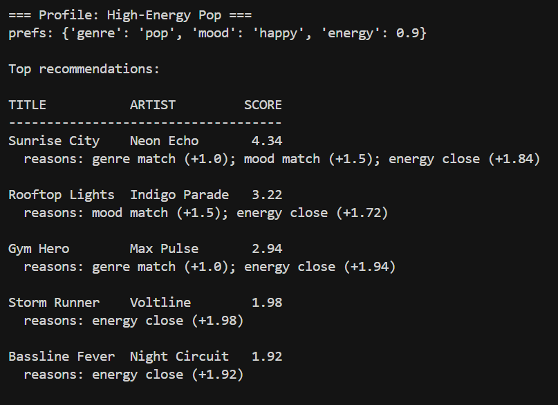
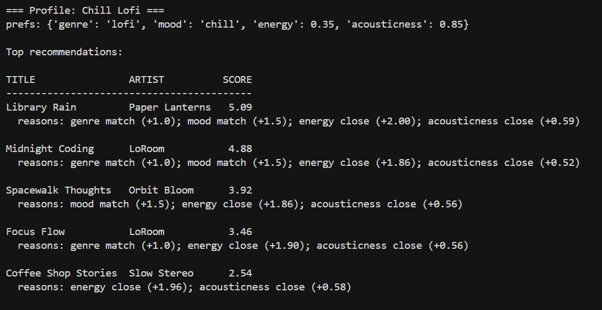
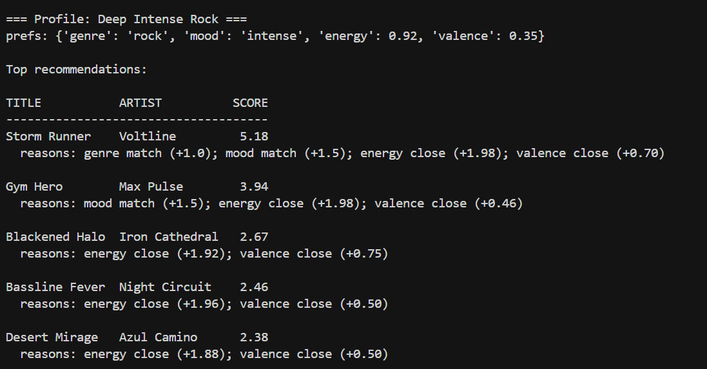
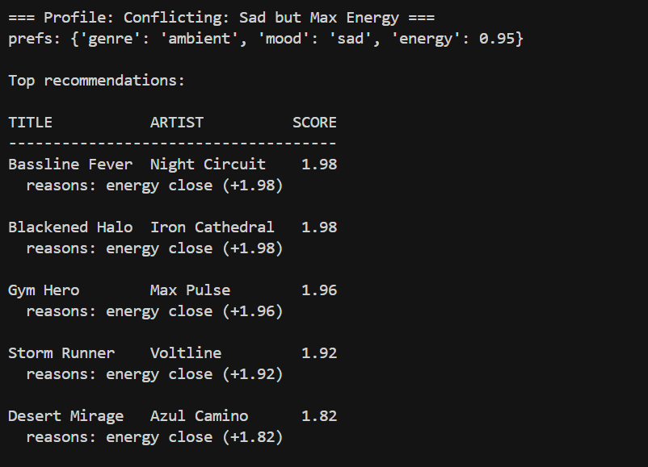
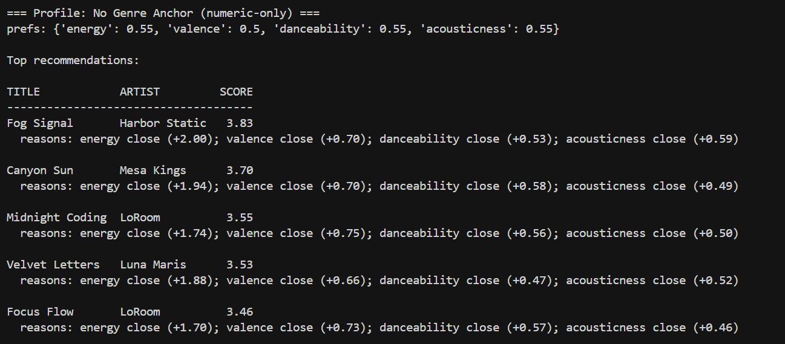

# 🎵 Music Recommender Simulation

## Project Summary

In this project you will build and explain a small music recommender system.

Your goal is to:

- Represent songs and a user "taste profile" as data
- Design a scoring rule that turns that data into recommendations
- Evaluate what your system gets right and wrong
- Reflect on how this mirrors real world AI recommenders

This version builds a content-based music recommender that scores each song against a user's stated preferences using a weighted formula. It rewards songs whose genre and mood match the user's profile (categorical features, higher weight) and songs whose energy and valence are numerically close to what the user prefers (proximity scoring). The system ranks all songs by score and returns the top matches — no listening history or collaborative filtering required.

---

## How The System Works

Real-world recommenders like Spotify or YouTube work by building a model of your taste from your listening history and comparing it to a catalog of items described by their features. At scale they use neural networks and collaborative filtering (finding users who sound like you and recommending what they liked). Our simulation skips the history-learning step and instead asks the user to declare their preferences directly — then applies the same core idea: turn both the user and every song into numbers, measure how close they are, and surface the closest matches.

Our version prioritizes **vibe alignment over novelty**: it rewards songs that match what you said you want right now (genre, mood, energy level, and emotional positivity) rather than surprising you with something different. This makes it transparent and predictable, which is useful for a classroom simulation but would feel too narrow in a real product.

### Features Used

**`Song` data (from `data/songs.csv`):**
- `genre` — categorical label for style (e.g., lofi, reggae, metal)
- `mood` — categorical label for context/vibe (e.g., focused, party, serene)
- `energy` — float 0.0–1.0, perceived intensity
- `valence` — float 0.0–1.0, emotional positivity (low = darker, high = more upbeat)
- `danceability` — float 0.0–1.0, how strongly the track supports steady dancing/groove
- `acousticness` — float 0.0–1.0, how acoustic vs. synthetic the instrumentation feels
- `tempo_bpm` — integer BPM (stored for analysis/experiments; optional to score)

**`UserProfile` object:**
- `preferred_genre` — the genre the user most wants to hear right now
- `preferred_mood` — the mood/context the user is in
- `preferred_energy` — float 0.0–1.0, how intense the user wants the music to feel
- `preferred_valence` — float 0.0–1.0, how upbeat vs. dark the user wants the sound
- `preferred_danceability` — float 0.0–1.0, target groove/dance feel
- `preferred_acousticness` — float 0.0–1.0, target acoustic vs. synthetic feel

### Algorithm Recipe (one song)

```
score = (2.0 × genre_match)
      + (1.5 × mood_match)
      + (1.0 × (1 - |song.energy        - user.preferred_energy|))
      + (0.8 × (1 - |song.valence       - user.preferred_valence|))
      + (0.6 × (1 - |song.danceability  - user.preferred_danceability|))
      + (0.6 × (1 - |song.acousticness  - user.preferred_acousticness|))
```

- `genre_match` and `mood_match` are 1 if they match, 0 if not
- The proximity formula `1 - |difference|` returns 1.0 for a perfect match and 0.0 for maximum mismatch
- Genre and mood are weighted highest because they set the biggest “vibe boundaries”
- Numeric features are fine-grained tuning within (or near) a matched genre/mood

### Ranking Rule (choosing recommendations)

Apply the scoring rule to every song in the catalog, sort all scores from highest to lowest, and return the top-N results. Ties are broken by the order they appear in the catalog.

### Data Flow (at a glance)

```mermaid
flowchart TD
  A[Input: UserProfile preferences] --> B[Load songs.csv]
  B --> C{For each song row}
  C --> D[Compute score using weights<br/>genre match, mood match,<br/>energy/valence/danceability/acousticness closeness]
  D --> E[Store (song, score)]
  E --> C
  E --> F[Sort all songs by score (desc)]
  F --> G[Output: Top K recommendations]
```

### Expected Biases / Limitations

- This system may over-prioritize exact genre labels, under-recommending cross-genre songs that still match the user's mood and numeric vibe.
- Results are limited by the catalog: if some genres or moods are missing or underrepresented in `songs.csv`, the recommender cannot surface them.

---

## Getting Started

### Setup

1. Create a virtual environment (optional but recommended):

   ```bash
   python -m venv .venv
   source .venv/bin/activate      # Mac or Linux
   .venv\Scripts\activate         # Windows

2. Install dependencies

```bash
pip install -r requirements.txt
```

3. Run the app:

```bash
python -m src.main
```

### Running Tests

Run the starter tests with:

```bash
pytest
```

You can add more tests in `tests/test_recommender.py`.

---

## Experiments You Tried

Use this section to document the experiments you ran. For example:

- What happened when you changed the weight on genre from 2.0 to 0.5
- What happened when you added tempo or valence to the score
- How did your system behave for different types of users

### CLI Output Screenshots (System Evaluation)

- High-Energy Pop
  
- Chill Lofi
  
- Deep Intense Rock
  
- Conflicting Sad + Max Energy (adversarial)
  
- Numeric-Only Profile (no genre/mood anchor)
  

> Note: take one terminal screenshot per profile run and save each image to the matching `assets/` filename above.

---

## Limitations and Risks

Summarize some limitations of your recommender.

Examples:

- It only works on a tiny catalog
- It does not understand lyrics or language
- It might over favor one genre or mood

You will go deeper on this in your model card.

---

## Reflection

Read and complete `model_card.md`:

[**Model Card**](model_card.md)

Write 1 to 2 paragraphs here about what you learned:

- about how recommenders turn data into predictions
- about where bias or unfairness could show up in systems like this


---

## 7. `model_card_template.md`

Combines reflection and model card framing from the Module 3 guidance. :contentReference[oaicite:2]{index=2}  

```markdown
# 🎧 Model Card - Music Recommender Simulation

## 1. Model Name

Give your recommender a name, for example:

> VibeFinder 1.0

---

## 2. Intended Use

- What is this system trying to do
- Who is it for

Example:

> This model suggests 3 to 5 songs from a small catalog based on a user's preferred genre, mood, and energy level. It is for classroom exploration only, not for real users.

---

## 3. How It Works (Short Explanation)

Describe your scoring logic in plain language.

- What features of each song does it consider
- What information about the user does it use
- How does it turn those into a number

Try to avoid code in this section, treat it like an explanation to a non programmer.

---

## 4. Data

Describe your dataset.

- How many songs are in `data/songs.csv`
- Did you add or remove any songs
- What kinds of genres or moods are represented
- Whose taste does this data mostly reflect

---

## 5. Strengths

Where does your recommender work well

You can think about:
- Situations where the top results "felt right"
- Particular user profiles it served well
- Simplicity or transparency benefits

---

## 6. Limitations and Bias

Where does your recommender struggle

Some prompts:
- Does it ignore some genres or moods
- Does it treat all users as if they have the same taste shape
- Is it biased toward high energy or one genre by default
- How could this be unfair if used in a real product

---

## 7. Evaluation

How did you check your system

Examples:
- You tried multiple user profiles and wrote down whether the results matched your expectations
- You compared your simulation to what a real app like Spotify or YouTube tends to recommend
- You wrote tests for your scoring logic

You do not need a numeric metric, but if you used one, explain what it measures.

---

## 8. Future Work

If you had more time, how would you improve this recommender

Examples:

- Add support for multiple users and "group vibe" recommendations
- Balance diversity of songs instead of always picking the closest match
- Use more features, like tempo ranges or lyric themes

---

## 9. Personal Reflection

A few sentences about what you learned:

- What surprised you about how your system behaved
- How did building this change how you think about real music recommenders
- Where do you think human judgment still matters, even if the model seems "smart"

